# MightyOakEngine - A Game Engine Made from Scratch in C++
## Original name GAM1573_22W ie. Game and Graphics Programming III Winter 2022
This is a simple engine made from scratch in c++ during my last Game and Graphics class. All and all I am quite proud of it. The last things we did were add the ability to loading OBJ files, converting the project to a component system and add lighting. My next goal after the class was to add shadows and multi pass rendering but the rest of my courses took priority. Hopefully at one point I will be able to return to this to finish it off and do more experimentation as working on this was more enjoyable then most of the work I've done in other engines.

## Scenes:
**Assignment 1 : Shaun's Great Escape**
* We were given a game idea and sprites and asked to make a game where a sheep tried to jump off the edge of a platform without getting hit by the meteors. This reminded me off Shaun the sheep and the moon of cheese from Wallace and Gromit so much that I took a week to remake all the sprites (except the background and platform those came from Humble Bundle assets I owned and just recoloured). I setup a few animation cycles worth because I was having so much fun and gave it a fun name.
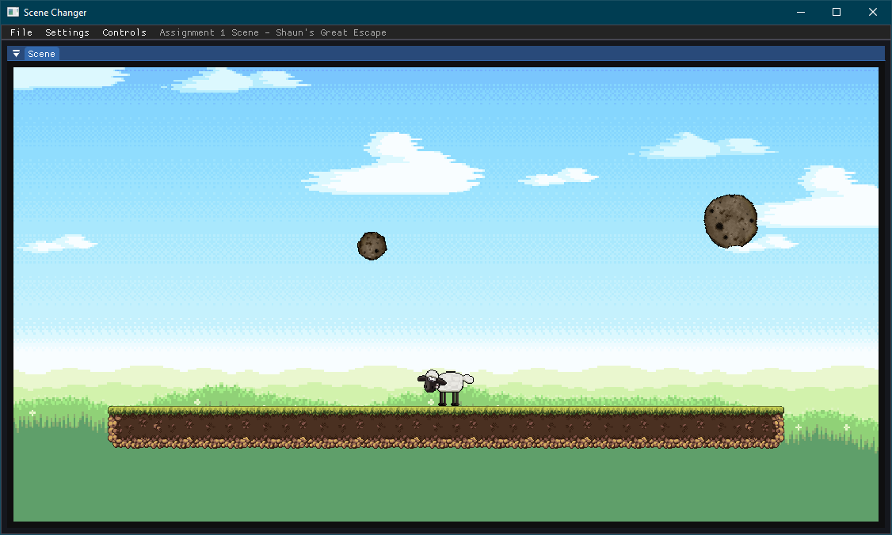
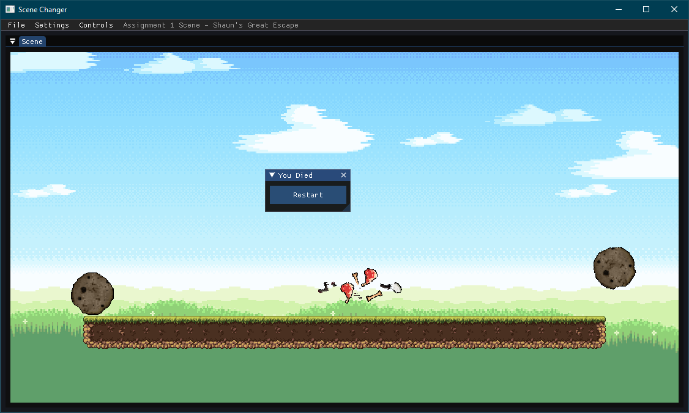

**Assignment 2 : 3D Physics Playground**
* We were given the task of setting up multiple physics interactable and joints and creating a scene to demo them. I took the time to make some simple textures for the blocks to show what to do and also took this early opertunity to start playing with lights.
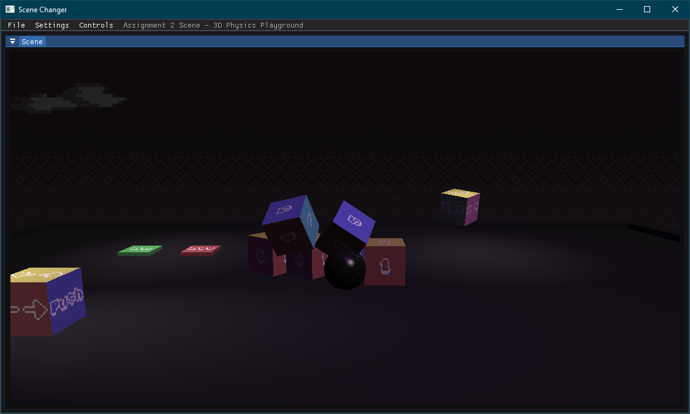

**Cube Demo**
* This was the very first scene we made just getting a 3D cube made of vertices defines in code and UVs to match a texture in a straight line. Rotaiting to show all sides.
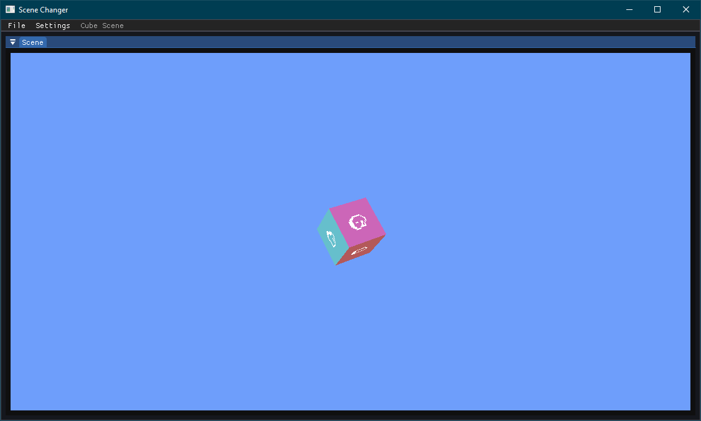

**Obj Loader**
* Demo's the Obj loader which will load in any obj and matching texture with settings to rotate around it and move it around in the space. By default it loads a model of an Arcade Cabinet I made years ago for Virtual Desktop (the VR one not the windows one) so I could play arcade games through it on this cabinet. This was before building my own Cabinet but being quite proud of it I wanted to use my own model for the demo of the feature.
* This is before lighting. The lighting in scene is just baked lighting from Blender as Virtual Desktop did not have lights at the time I made the model.
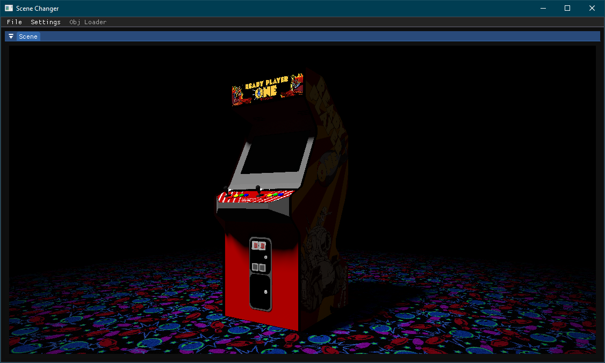

**Lighting Scene**
* The first demo of lighting this consist of a ball that you can move around as the "player" as the teacher noted it's round surface makes it ideal for testing the lighting effects. In the scene there is the Arcade Cabinet, a white box, a red box, a textured one and 4 over head lights in the corners (white, red, blue, green), with a spot light shining on the cabinet and a directional light set to black as it makes it hard to see the other lights but it can be adjusted like all the objects through the Settings Menu's Scene Object list. This will pop open Imgui windows with individual settings for each light and object.
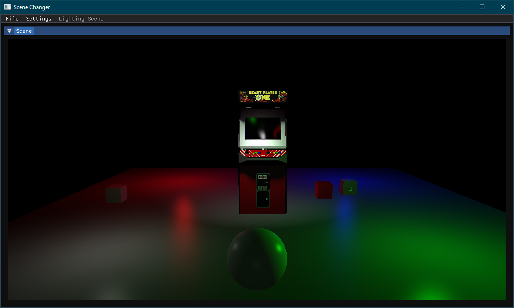

**2D Physics Scene**
* This was an early demo of getting a physics engine Box2D in this instance added to the project prior to us making Assignment 1
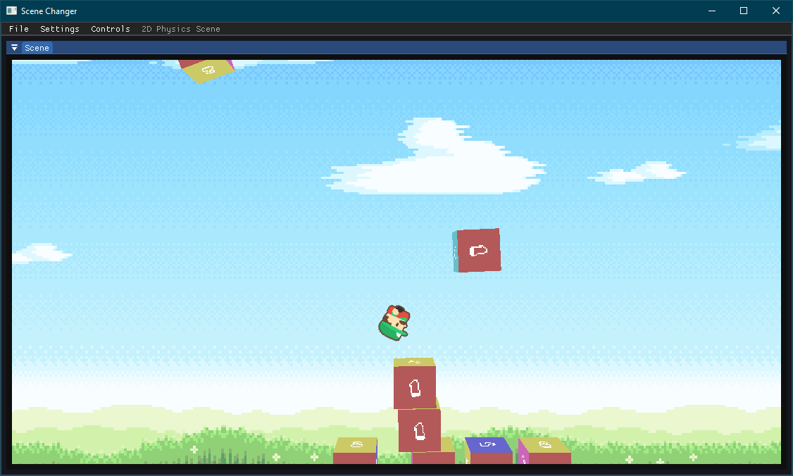

**Rock Paper Scissors Scene**
* This was an in Class test where we needed to use our engine to create a rock paper scissors game within 3 hours using the provided pictures. The controls can be found in the top bar.
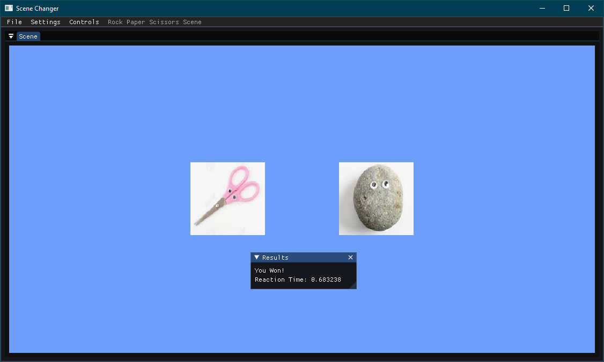

**Water Shader Demo**
* As the name suggest just a demo of a water shader we made in class from scratch. The teacher provided the texture and started everyone off but left the math for moving the verts and making it look smooth mostly to us with the requirment that you could scale it through the menus.
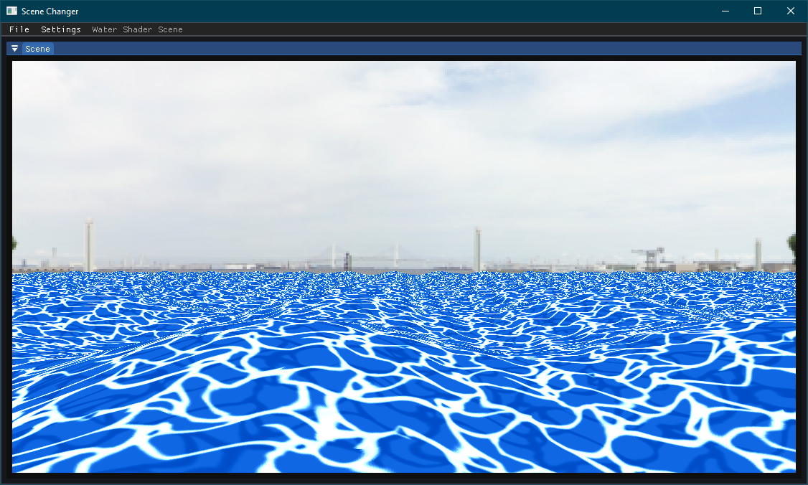
 
## Other Features:
A full Gui using Imgui allowing you to Dock and resize windows with a File and Scene Settings menu. Holding a windows title bar will show the docking options allowing you to organize the screen as you like.
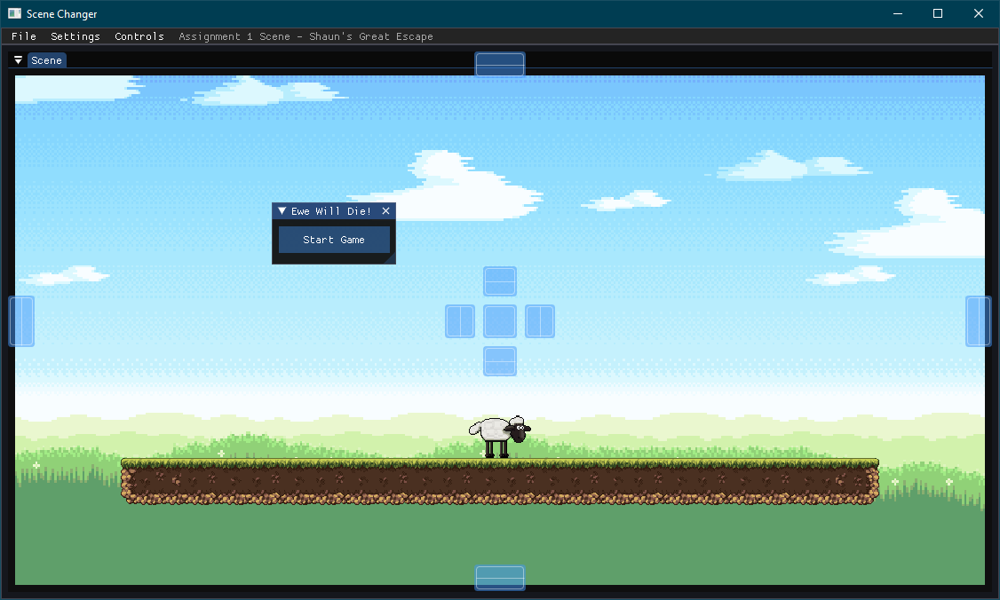
* Scene Title each scene will show it's name in the Menu bar after the last menu option
* File allows you to load the diffrent Scenes, Show The Imgui Demo, Enable Wire Frames, Change and Reset the Background Color. It also has a quite option unfortunatly I did not get around to implementing the shown keyboard shortcuts
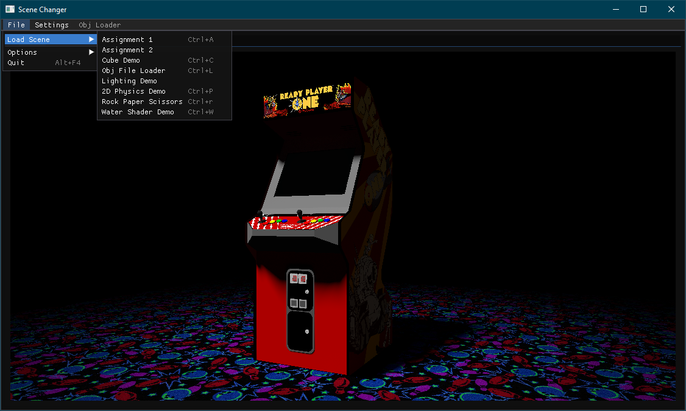
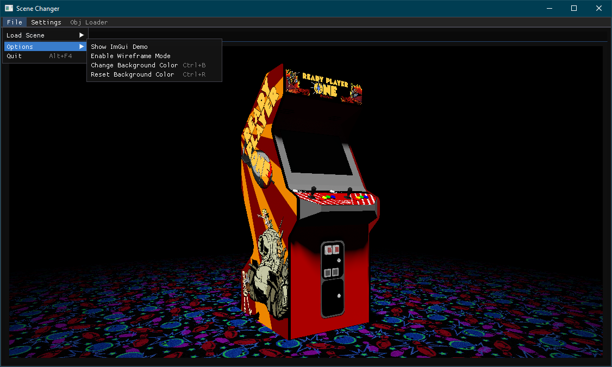
* Settings all ways contains a Scene Objects List and a pop out for opening individual Object settings in a seprate window. Out side of this each scene may have additional options in this menu
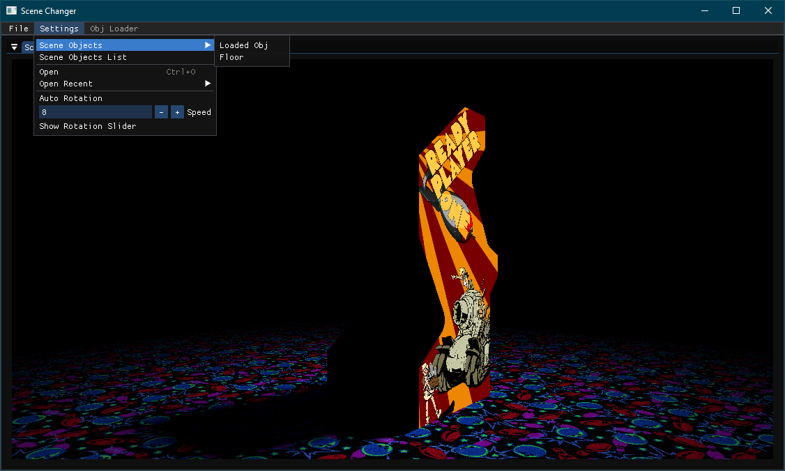
* Controls those scenes with something to control will have a menu which will list the unique controls for that scene
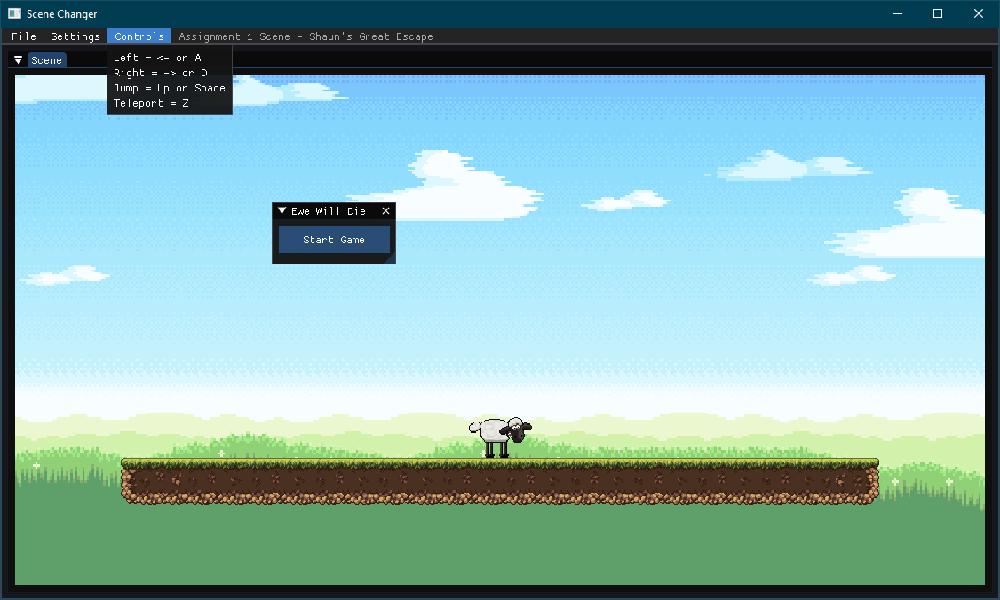

 